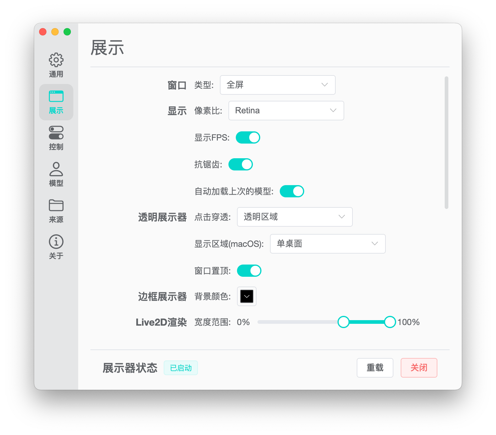

# Hime Display

<p align="center">

</p>

> illustrated by [MakoSaikou](https://www.pixiv.net/users/72669923)

[English](./README.md) | 简体中文 | [日本語](./README-JP.md)

[下载](https://hime.xdrv.cn/download/) | [文档](https://hime.xdrv.cn/)

此应用旨在打造一个开源、跨平台的通用桌面模型展示器。

## 预览

### 控制面板

<p align="center">

</p>

### 展示器

什么没看见？那就对了，展示器其实就是一个透明窗口。

## 特性

1. 多种模型类型支持：支持载入 Live2D、MMD、VRoid、Spine 四种模型。
2. 动作捕捉：借助于 Google 的 MediaPipe 对 Live2D、MMD、VRoid 提供了动捕支持。
3. 跨平台：同时对 macOS 与 Windows 提供了支持。
4. 多语言支持： 对简体中文、日语、英语提供了支持。
5. 全面的模型控制：可对模型的进行各种操作，包括骨骼变换，变形，动画播放。
6. 动画转译：MMD 模型可以直接加载来源于 Mixamo 的动画（VRoid 计划之后支持）。

## 基础载入

### 模型库数据库设计

以一个或多个文件路径作为数据源，根据一些模型文件特征，递归检测该路径下的模型，添加至数据库后载入。

### 加载模型的方法

1. 在控制面板中点击`来源`；
2. 然后`添加数据源`，选择模型及动作文件，音频所在的目录；
3. 点击数据源操作中的刷新按钮；
4. 点击控制面板菜单中的`模型`，在模型数据库中选择希望载入的模型，选中的模型将会高亮显示；
5. 然后点击数据库下方的`载入选中模型`。

### 注意事项

1. 不同类型的模型以及音频与动作文件均可放置到同一数据源下。
2. 为提高效率和增强通用性，对于大多数文件类型，该检测过程没有读取文件的内容，主要通过文件扩展名判断，因此即使文件存在问题或者不支持，也有可能被载入到数据库中。
3. 对于模型文件，由于一些类型的模型的文件名称通常不是模型名称，将以模型文件的上级目录名作为模型名称，因此在同一目录下放置多个模型可能命名混乱。
4. 对于音频与动作文件，文件名通常与内容直接相关，因此将直接采用文件名作为名称，同时放到同一个目录下不会造成命名混乱。
5. 添加数据源后可以点击编辑检索类型，默认检测全部类型。
6. 执行刷新操作后，将自动更新统计信息，模型数据库，音频数据库，动作数据库（后两者在 3D 模型的动画控制页面中显示）。

## 模型机能对比

|          |        MMD        |        VRoid        |           Live2D            |             Spine             |
| :------: | :---------------: | :-----------------: | :-------------------------: | :---------------------------: |
| 模型信息 |        ✅         |         ✅          |             ✅              |              ✅               |
| 对象变换 |        ✅         |         ✅          |             ✅              |              ✅               |
| 动画播放 |        ✅         |  ❌<br/>（待开发）  |             ✅              |              ✅               |
| 物理模拟 | ✅<br/>（仅动画） | ✅<br/>（所有状态） | ❌<br/>（好像有，还没深究） | ❌<br/>（Spine 跟我扯这个？） |
| 参数控制 |       变形        |        变形         |     Parameter<br/>Part      |      ❌<br/>（人懒没做）      |
| 面部捕捉 |        ✅         |         ✅          |             ✅              |     ❌<br/>（无参数规范）     |
| 全身捕捉 |        ✅         |         ✅          |    ❌<br/>（无参数规范）    |     ❌<br/>（无参数规范）     |

## 主要开发技术

本应用使用前端技术，基于[Electron](https://www.electronjs.org/)开发，构建工具使用了[Vite](https://vitejs.dev/)。

数据库存储采用了[lowdb](https://github.com/typicode/lowdb)。

多语言的支持采用了[i18next](https://www.i18next.com/)。

控制面板采用[Vue](https://vuejs.org/)框架开发，使用了[Element Plus](https://element-plus.org/)组件库。

2D 模型使用[Pixi.js](https://pixijs.com/)作为渲染引擎，3D 模型使用[Three.js](https://threejs.org/)作为渲染引擎。

动作捕捉使用了 Google 的[MediaPipe](https://mediapipe.dev/)进行识别，并使用[Kalidokit](https://github.com/yeemachine/kalidokit)进行捕捉数据解析。

## 开发

```bash
# 安装依赖
yarn
# 启动
yarn start
# 构建（具体build版本可以在根目录下的build.config.js文件中配置）
yarn run build
```

### 若安装 electron 出现问题

在国内可能会遇到无法安装 electron 的情况，本来用 cnpm 的话直接完美解决问题，但是由于这个项目使用了 yarn 的 workspace，使用 cnpm 也可能会出现一些问题。如果遇到使用 yarn 命令无法安装 electron 的情况，可以在项目的根目录新建`.yarnrc`文件配置代理源，内容如下：

```
registry "https://registry.npm.taobao.org"
sass_binary_site "https://npm.taobao.org/mirrors/node-sass/"
phantomjs_cdnurl "http://cnpmjs.org/downloads"
electron_mirror "https://npm.taobao.org/mirrors/electron/"
sqlite3_binary_host_mirror "https://foxgis.oss-cn-shanghai.aliyuncs.com/"
profiler_binary_host_mirror "https://npm.taobao.org/mirrors/node-inspector/"
chromedriver_cdnurl "https://cdn.npm.taobao.org/dist/chromedriver"
```

## Special Thanks

这是我的初次尝试开发一个完整的应用，各方面经验都十分欠缺。

本项目的文件结构参考了同样使用 Electron 开发的下载工具[Motrix](https://motrix.app/)，在此表示感谢。

感谢 [笺染菲素](https://space.bilibili.com/33572615) 测试应用并提供了不少建议。

感谢 [HuiDesktop](https://github.com/HuiDesktop/HuiDesktop) 的作者 [pure01fx](https://github.com/pure01fx) 提供的 Spine 方面的一些技术支持。

感谢 [greenjerry](https://github.com/greenjerry) 对我在物质，精神层面，以及软件和硬件上的大力支持。
